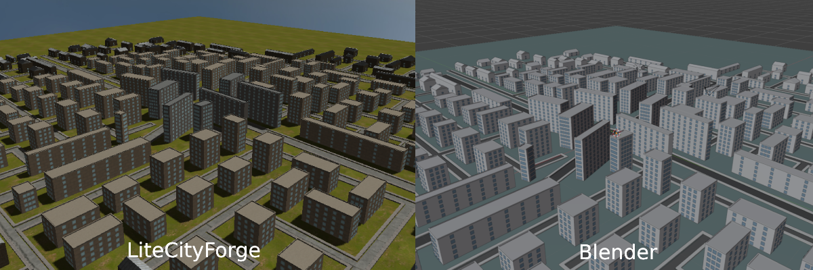

<h1> LiteCityForge / Procedural City Generation Tool </h1>
<p>An interactive C++ and OpenGL tool for generating customizable 3D cities</p>
<h6>C++17 · OpenGL 3.3 · GLSL · GLFW · Dear ImGui · CMake</h6>


<h3>What is LiteCityForge?</h3>
<p>LiteCityForge is an interactive C++17 and OpenGL application for generating customizable 3D city layouts. Starting from a user-selected seed and generation settings, it builds a road network, subdivides the surrounding land into lots, and creates building footprints and geometry with varied urban density. A graphical interface lets you tune generation and appearance, inspect the result in 2D or 3D, and export selected city elements as OBJ and MTL files for use in other 3D tools.</p>

<h3>Features</h3>
<ul>
  <li>Generate road networks, city blocks, building lots, and 3D buildings from a configurable seed.</li>
  <li>Adjust generation settings for city size, road layout, lot coverage, and urban density.</li>
  <li>Explore generated cities in 2D or 3D.</li>
  <li>Customize the scene’s materials and textures through the GUI.</li>
  <li>Export selected city geometry as OBJ files with accompanying MTL materials.</li>
</ul>

<h3>Build and run (Windows) 🪟</h3>
<h4>Requirements:</h4>
<ul>
  <li>Windows 10 or 11</li>
  <li>Git for Windows</li>
  <li>Visual Studio 2022 with the "Desktop development with C++" workload</li>
  <li>CMake 3.16 or newer</li>
  <li>A graphics card and driver that support OpenGL 3.3</li>
</ul>
<h4>Build steps</h4>
<ol>
  <li>Open PowerShell in the folder </li>
  <li>Clone the repository:

   ```powershell
   git clone https://github.com/MMulevicius/LiteCityForge.git
   ```
  </li>
  <li>Move into the project folder:

   ```powershell
   cd LiteCityForge
   ```
  </li>
  <li>Configure the project with CMake. This creates a `build` folder and generates Visual Studio build files for 64-bit Windows:

   ```powershell
   cmake -S . -B build -A x64
   ```
  </li>
  <li>Compile the project in Release mode:

   ```powershell
   cmake --build build --config Release
   ```
  </li>
  <li>Run the application from the project folder:

   ```powershell
   .\build\Release\ProceduralCityGenerator.exe
   ```
  </li>
  <p>NOTE: CMake copies the required "assets" folder beside the executable during the build.</p>
</ol>

<h3>Build and run (Arch Linux) 🐧</h3>
<h4>Requirements:</h4>
<ul>
  <li>A C++17 compiler, such as GCC</li>
  <li>CMake 3.16 or newer</li>
  <li>Git</li>
  <li>X11 and OpenGL development packages</li>
  <li>An OpenGL 3.3-capable graphics driver</li>
</ul>

<h4>Build steps</h4>
<ol>
  <li>Install required packages:
    
  ```bash
  sudo pacman -S --needed base-devel cmake git mesa libglvnd \
    xorgproto libx11 libxext libxrandr libxinerama libxcursor libxi
  ```
  </li>
  <li>
    Clone the repository:

   ```bash
   git clone https://github.com/MMulevicius/LiteCityForge.git
   ```
  </li>
  <li>Go into the project folder:

   ```bash
   cd LiteCityForge
   ```
  </li>
  <li>Configure a Release build:

   ```bash
   cmake -S . -B build -DCMAKE_BUILD_TYPE=Release
   ```
  </li>
  <li>Build the application:

   ```bash
   cmake --build build --parallel
   ```
  </li>
  <li>Run it:

   ```bash
   ./build/ProceduralCityGenerator
   ```
  </li>
</ol>
<h2>Controls</h2>

<table>
  <thead>
    <tr>
      <th>Mode</th>
      <th>Input</th>
      <th>Action</th>
    </tr>
  </thead>
  <tbody>
    <tr>
      <td>2D</td>
      <td><kbd>W</kbd> <kbd>A</kbd> <kbd>S</kbd> <kbd>D</kbd></td>
      <td>Pan the camera</td>
    </tr>
    <tr>
      <td>2D</td>
      <td>Scroll wheel</td>
      <td>Zoom in or out</td>
    </tr>
    <tr>
      <td>3D</td>
      <td><kbd>W</kbd> <kbd>A</kbd> <kbd>S</kbd> <kbd>D</kbd></td>
      <td>Move the camera</td>
    </tr>
    <tr>
      <td>3D</td>
      <td><kbd>Q</kbd> / <kbd>E</kbd></td>
      <td>Move down / up</td>
    </tr>
    <tr>
      <td>3D</td>
      <td>Hold right mouse button and move mouse</td>
      <td>Look around</td>
    </tr>
    <tr>
      <td>Any</td>
      <td><kbd>Esc</kbd></td>
      <td>Exit the application</td>
    </tr>
  </tbody>
</table>

<p>Switch between 2D and 3D using the <strong>3D mode</strong> checkbox.</p>

<h3>Export</h3>


<p>LiteCityForge exports generated city geometry as a Wavefront OBJ file with a companion MTL file for basic material colours. You can choose the output folder and file name, and select which building parts to include. The export contains mesh positions, faces, and normals, but not texture images or UV coordinates, so the city’s textured appearance won’t carry over to other 3D software; camera, lighting, and generation settings are not saved either.</p>

<h3>Process</h3>
<p>Road generation uses a seeded, priority-driven graph expansion algorithm. The user’s seed initializes the random number generator, and the algorithm places candidate road segments in a priority queue. It expands the network in two phases: first, it builds the primary highway structure from the city centre; then, it seeds and expands secondary streets from the accepted highways. Each candidate is evaluated before being added to the road graph, and accepted candidates can create further segments for later evaluation.

Candidate validation applies both global and local constraints. Global constraints keep roads within the defined city boundary. Local constraints, used primarily when generating streets, control factors such as road angles and minimum spacing between nodes, and prevent invalid intersections with existing segments. To avoid checking the entire network for every candidate, the RoadQuery system uses a spatial hash grid: nodes are indexed by grid cell, while road segments are indexed in the cells overlapped by their bounding boxes. Queries use nearby cells to gather candidates for distance and intersection checks.

<p><table>
  <thead>
    <tr>
      <th>Scope</th>
      <th>Rule</th>
      <th>Implementation</th>
    </tr>
  </thead>
  <tbody>
    <tr>
      <td>Global</td>
      <td>City boundary</td>
      <td>
        A candidate endpoint must remain within <code>cityRadius</code>
        of <code>cityCenter</code>.
      </td>
    </tr>
    <tr>
      <td>Local</td>
      <td>Minimum angle at a node</td>
      <td>
        <code>minAngleDeg</code> rejects a candidate whose direction is too
        close to an existing road direction at its start node. The check runs
        only when that node already has at least two connected segments.
      </td>
    </tr>
    <tr>
      <td>Local</td>
      <td>Minimum node spacing</td>
      <td>
        <code>minNodeSpacing</code> rejects candidate endpoints that are too
        close to existing nodes, subject to the snapped-endpoint behavior
        described below.
      </td>
    </tr>
    <tr>
      <td>Local</td>
      <td>Segment intersection</td>
      <td>
        <code>intersectionTol</code> is used when checking a candidate against
        nearby existing segments. Existing segments connected to the
        candidate's start node are skipped.
      </td>
    </tr>
    <tr>
      <td>Local</td>
      <td>Minimum segment spacing</td>
      <td>
        <code>minSegmentSpacing</code> rejects a candidate if either of its
        endpoints is too close to a nearby existing segment.
      </td>
    </tr>
    <tr>
      <td>Local — streets</td>
      <td>Highway attachment and clearance</td>
      <td>
        Streets may snap to a nearby highway node within
        <code>streetHighwayAttachRadius</code>. If a street is not connected
        to a highway, <code>streetHighwayKeepawayRadius</code> is used to
        prevent it from passing too close to highway geometry, with an
        exception near its starting connection.
      </td>
    </tr>
    <tr>
      <td>Local — connectivity</td>
      <td>Endpoint snapping and loop closure</td>
      <td>
        Candidate endpoints can snap to a nearby existing node within
        <code>snapRadius</code>. A randomized loop-closing check can also
        snap an endpoint within <code>loopCloseRadius</code>, based on
        <code>loopCloseChance</code>.
      </td>
    </tr>
    <tr>
      <td>Generation limits</td>
      <td>Termination caps</td>
      <td>
        <code>maxIterations</code>, <code>maxSegments</code>, and
        <code>maxStreetSegments</code> limit how long generation continues
        and how many segments it adds.
      </td>
    </tr>
  </tbody>
</table></p>

After the road graph is built, road adjacency and boundary offsets are used to derive buildable plots rather than detecting only fully enclosed road loops. The plots are assigned urban, suburban, or rural characteristics according to their distance from the city centre. Those zones influence plot and building dimensions, density, and height limits. Setbacks define the usable area within each plot, and adaptive footprint rules with controlled variation fit buildings to that area. The resulting road, sidewalk, and building meshes are assembled into scene data for rendering.</p>


<h3>Known limitations</h3>
<ul>
  <li>Road-junction geometry artifacts</li>
  <li>Not adjusted rules for different angle generation</li>
  <li>Long generation time at large settings</li>
  <li>Empty garden areas</li>
  <li>Limited architectural variety and realism</li>
  <li>Export limitations</li>
</ul>

<h3>Licensing</h3>
<p>LiteCityForge's code is licensed under the MIT License; see [LICENSE](LICENSE). Third-party libraries and assets retain their own licenses and notices; see [THIRD_PARTY_NOTICES.md](THIRD_PARTY_NOTICES.md).</p>

