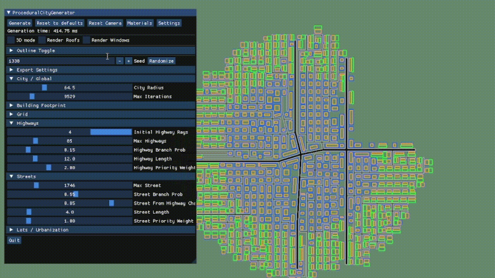

<h1> LiteCityForge / Procedural City Generation Tool </h1>

An interactive C++ and OpenGL tool for generating customizable 3D cities

<h3>What is LiteCityForge?</h3>

LiteCityForge is an interactive C++17 and OpenGL application for generating customizable 3D city layouts. Starting from a user-selected seed and generation settings, it builds a road network, subdivides the surrounding land into lots, and creates building footprints and geometry with varied urban density. A graphical interface lets you tune generation and appearance, inspect the result in 2D or 3D, and export selected city elements as OBJ and MTL files for use in other 3D tools.

<h3>Features</h3>
<ul>
  <li>Generate road networks, city blocks, building lots, and 3D buildings from a configurable seed.</li>
  <li>Adjust generation settings for city size, road layout, lot coverage, and urban density.</li>
  <li>Explore generated cities in 2D or 3D.</li>
  <li>Customize the scene’s materials and textures through the GUI.</li>
  <li>Export selected city geometry as OBJ files with accompanying MTL materials.</li>
</ul>
